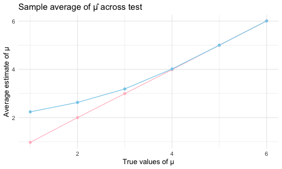

HW_5
================
Amy Liu
2023-11-12

## Problem 1

Import dataset:

``` r
homicide_data =
  read_csv("https://raw.githubusercontent.com/washingtonpost/data-homicides/master/homicide-data.csv") %>% 
  janitor::clean_names()
```

    ## Rows: 52179 Columns: 12
    ## ── Column specification ────────────────────────────────────────────────────────
    ## Delimiter: ","
    ## chr (9): uid, victim_last, victim_first, victim_race, victim_age, victim_sex...
    ## dbl (3): reported_date, lat, lon
    ## 
    ## ℹ Use `spec()` to retrieve the full column specification for this data.
    ## ℹ Specify the column types or set `show_col_types = FALSE` to quiet this message.

``` r
homicide_data
```

    ## # A tibble: 52,179 × 12
    ##    uid        reported_date victim_last  victim_first victim_race victim_age
    ##    <chr>              <dbl> <chr>        <chr>        <chr>       <chr>     
    ##  1 Alb-000001      20100504 GARCIA       JUAN         Hispanic    78        
    ##  2 Alb-000002      20100216 MONTOYA      CAMERON      Hispanic    17        
    ##  3 Alb-000003      20100601 SATTERFIELD  VIVIANA      White       15        
    ##  4 Alb-000004      20100101 MENDIOLA     CARLOS       Hispanic    32        
    ##  5 Alb-000005      20100102 MULA         VIVIAN       White       72        
    ##  6 Alb-000006      20100126 BOOK         GERALDINE    White       91        
    ##  7 Alb-000007      20100127 MALDONADO    DAVID        Hispanic    52        
    ##  8 Alb-000008      20100127 MALDONADO    CONNIE       Hispanic    52        
    ##  9 Alb-000009      20100130 MARTIN-LEYVA GUSTAVO      White       56        
    ## 10 Alb-000010      20100210 HERRERA      ISRAEL       Hispanic    43        
    ## # ℹ 52,169 more rows
    ## # ℹ 6 more variables: victim_sex <chr>, city <chr>, state <chr>, lat <dbl>,
    ## #   lon <dbl>, disposition <chr>

The dataset has 12 rows and 52179 observations. Variables include
uid,reported_date,victim_last,victim_first,victim_race,victim_age,victim_sex,city,state,
lat, lon, and disposition.

- Create a city_state variable (e.g. “Baltimore, MD”) and then summarize
  within cities to obtain the total number of homicides and the number
  of unsolved homicides (those for which the disposition is “Closed
  without arrest” or “Open/No arrest”).

``` r
homicide_tidy_df=
  homicide_data %>% 
  mutate(
    city_state = paste(city, state, sep=", "),
  ) %>% 
  group_by(city_state) %>%
  summarize(total_homicides = n(), 
            unsolved_homicides = sum(disposition %in% c("Closed without arrest", "Open/No arrest"))
  )

homicide_tidy_df
```

    ## # A tibble: 51 × 3
    ##    city_state      total_homicides unsolved_homicides
    ##    <chr>                     <int>              <int>
    ##  1 Albuquerque, NM             378                146
    ##  2 Atlanta, GA                 973                373
    ##  3 Baltimore, MD              2827               1825
    ##  4 Baton Rouge, LA             424                196
    ##  5 Birmingham, AL              800                347
    ##  6 Boston, MA                  614                310
    ##  7 Buffalo, NY                 521                319
    ##  8 Charlotte, NC               687                206
    ##  9 Chicago, IL                5535               4073
    ## 10 Cincinnati, OH              694                309
    ## # ℹ 41 more rows

city_state variable is created. The total number of homicides and the
number of unsolved homicides are generated.

- For the city of Baltimore, MD, use the prop.test function to estimate
  the proportion of homicides that are unsolved; save the output of
  prop.test as an R object, apply the broom::tidy to this object and
  pull the estimated proportion and confidence intervals from the
  resulting tidy dataframe.

``` r
baltimore_df = 
  homicide_tidy_df %>% 
  filter(city_state == "Baltimore, MD")

baltimore_prop_test = 
  prop.test(baltimore_df$unsolved_homicides, baltimore_df$total_homicides) %>% 
  broom::tidy()
```

The estimated proportion of homicides that are unsolved is  
0.6455607, and the confidence interval is (0.6275625, 0.6631599).

- Now run prop.test for each of the cities in your dataset, and extract
  both the proportion of unsolved homicides and the confidence interval
  for each. Do this within a “tidy” pipeline, making use of purrr::map,
  purrr::map2, list columns and unnest as necessary to create a tidy
  dataframe with estimated proportions and CIs for each city.

``` r
prop_test_city <- function(unsolved, total) {
    prop_test <- prop.test(x = unsolved, n = total)
    return(prop_test)
    }

cities_prop = 
  homicide_tidy_df %>%
  mutate(
    prop_test_result = map2(unsolved_homicides, total_homicides, prop_test_city),
    prop_test = map(prop_test_result, broom::tidy)
  ) %>%
  select(city_state, prop_test) %>%
  unnest(prop_test) %>%
  select(city_state, estimate, conf.low, conf.high)
```

    ## Warning: There was 1 warning in `mutate()`.
    ## ℹ In argument: `prop_test_result = map2(unsolved_homicides, total_homicides,
    ##   prop_test_city)`.
    ## Caused by warning in `prop.test()`:
    ## ! Chi-squared approximation may be incorrect

``` r
cities_prop
```

    ## # A tibble: 51 × 4
    ##    city_state      estimate conf.low conf.high
    ##    <chr>              <dbl>    <dbl>     <dbl>
    ##  1 Albuquerque, NM    0.386    0.337     0.438
    ##  2 Atlanta, GA        0.383    0.353     0.415
    ##  3 Baltimore, MD      0.646    0.628     0.663
    ##  4 Baton Rouge, LA    0.462    0.414     0.511
    ##  5 Birmingham, AL     0.434    0.399     0.469
    ##  6 Boston, MA         0.505    0.465     0.545
    ##  7 Buffalo, NY        0.612    0.569     0.654
    ##  8 Charlotte, NC      0.300    0.266     0.336
    ##  9 Chicago, IL        0.736    0.724     0.747
    ## 10 Cincinnati, OH     0.445    0.408     0.483
    ## # ℹ 41 more rows

Create a plot

``` r
  cities_prop %>% 
  mutate(city_state = fct_reorder(city_state, estimate)) %>%
  ggplot(aes(x = city_state, y = estimate)) +
  geom_point() +
  geom_errorbar(aes(ymin = conf.low, ymax = conf.high)) +
  theme(axis.text.x = element_text(angle = 90, vjust = 0.5, hjust=1))
```


## Problem 2

- Start with a dataframe containing all file names; the list.files
  function will help
- Iterate over file names and read in data for each subject using
  purrr::map and saving the result as a new variable in the dataframe
- Tidy the result; manipulate file names to include control arm and
  subject ID, make sure weekly observations are “tidy”, and do any other
  tidying that’s necessary
- Make a spaghetti plot showing observations on each subject over time,
  and comment on differences between groups.

Import Data

``` r
data_files = tibble(list.files("./data")) %>% 
  mutate(file_list = paste(list.files("./data")))
```

Create function to read data files in the data set

``` r
  read_file_csv= function(x) {
    data = read_csv(paste0("./data/", x)) %>%
      mutate(file_names = x)
  }
  
longitudinal_study = map_df(data_files$file_list, read_file_csv)

longitudinal_study
```

    ## # A tibble: 20 × 9
    ##    week_1 week_2 week_3 week_4 week_5 week_6 week_7 week_8 file_names
    ##     <dbl>  <dbl>  <dbl>  <dbl>  <dbl>  <dbl>  <dbl>  <dbl> <chr>     
    ##  1   0.2   -1.31   0.66   1.96   0.23   1.09   0.05   1.94 con_01.csv
    ##  2   1.13  -0.88   1.07   0.17  -0.83  -0.31   1.58   0.44 con_02.csv
    ##  3   1.77   3.11   2.22   3.26   3.31   0.89   1.88   1.01 con_03.csv
    ##  4   1.04   3.66   1.22   2.33   1.47   2.7    1.87   1.66 con_04.csv
    ##  5   0.47  -0.58  -0.09  -1.37  -0.32  -2.17   0.45   0.48 con_05.csv
    ##  6   2.37   2.5    1.59  -0.16   2.08   3.07   0.78   2.35 con_06.csv
    ##  7   0.03   1.21   1.13   0.64   0.49  -0.12  -0.07   0.46 con_07.csv
    ##  8  -0.08   1.42   0.09   0.36   1.18  -1.16   0.33  -0.44 con_08.csv
    ##  9   0.08   1.24   1.44   0.41   0.95   2.75   0.3    0.03 con_09.csv
    ## 10   2.14   1.15   2.52   3.44   4.26   0.97   2.73  -0.53 con_10.csv
    ## 11   3.05   3.67   4.84   5.8    6.33   5.46   6.38   5.91 exp_01.csv
    ## 12  -0.84   2.63   1.64   2.58   1.24   2.32   3.11   3.78 exp_02.csv
    ## 13   2.15   2.08   1.82   2.84   3.36   3.61   3.37   3.74 exp_03.csv
    ## 14  -0.62   2.54   3.78   2.73   4.49   5.82   6      6.49 exp_04.csv
    ## 15   0.7    3.33   5.34   5.57   6.9    6.66   6.24   6.95 exp_05.csv
    ## 16   3.73   4.08   5.4    6.41   4.87   6.09   7.66   5.83 exp_06.csv
    ## 17   1.18   2.35   1.23   1.17   2.02   1.61   3.13   4.88 exp_07.csv
    ## 18   1.37   1.43   1.84   3.6    3.8    4.72   4.68   5.7  exp_08.csv
    ## 19  -0.4    1.08   2.66   2.7    2.8    2.64   3.51   3.27 exp_09.csv
    ## 20   1.09   2.8    2.8    4.3    2.25   6.57   6.09   4.64 exp_10.csv

Tidy the result

``` r
longitudinal_study_tidy = 
  longitudinal_study %>% 
  janitor::clean_names() %>%
  mutate(group = ifelse(grepl("con", file_names), "Control", "Experimental"), subject_id = row_number()) %>% 
  pivot_longer(
    cols = starts_with("week_"),
    names_to = "week", 
    values_to = "observation") %>% 
  select(-file_names) %>% 
  mutate(week = str_remove(week, "week_"))

longitudinal_study_tidy
```

    ## # A tibble: 160 × 4
    ##    group   subject_id week  observation
    ##    <chr>        <int> <chr>       <dbl>
    ##  1 Control          1 1            0.2 
    ##  2 Control          1 2           -1.31
    ##  3 Control          1 3            0.66
    ##  4 Control          1 4            1.96
    ##  5 Control          1 5            0.23
    ##  6 Control          1 6            1.09
    ##  7 Control          1 7            0.05
    ##  8 Control          1 8            1.94
    ##  9 Control          2 1            1.13
    ## 10 Control          2 2           -0.88
    ## # ℹ 150 more rows

Create a spaghetti plot

``` r
longitudinal_study_tidy |> 
  ggplot(aes(x = week, y = observation, group = subject_id, color = subject_id)) +
  geom_line() +
  facet_grid(~group)
```


``` r
  labs(
    title = "Control vs. Experimental Observations",
    x = "week",
    y = "observation",
    color = "subject_id"
    )
```

    ## $x
    ## [1] "week"
    ## 
    ## $y
    ## [1] "observation"
    ## 
    ## $colour
    ## [1] "subject_id"
    ## 
    ## $title
    ## [1] "Control vs. Experimental Observations"
    ## 
    ## attr(,"class")
    ## [1] "labels"

The control groups have lower observations than the experimental groups
within the 8 weeks. The experimental groups show an uphill increasing
trend. The observation for control groups fluctuate more than the
experimental groups.

## Problem 3

First set the following design elements: \* Fix n=30 \* Fix σ=5 Set μ=0,
Generate 5000 datasets from the model x∼Normal\[μ,σ\] For each dataset,
save μ̂ and the p-value arising from a test of H:μ=0 using α=0.05

``` r
sim_test = function(n = 30, mu, sd = 5) {
  x_vec = rnorm(n, mu, sd)
  t.test(x_vec) %>%  
  broom::tidy() %>% 
  select(mu_hat = estimate, p_value = p.value)
}

output = vector("list", length = 5000)

for (i in 1:5000) {
  output[[i]] = sim_test(mu = 0)
}

sim_result =
  bind_rows(output)
```

- Repeat the above for μ={1,2,3,4,5,6}

``` r
sim_test_mu = 
  expand_grid(mu_values = c(1,2,3,4,5,6), 
              iter = 1:5000) %>% 
  mutate(
    estimates_df = map(mu_values, ~sim_test(n = 30, mu = .))) %>%
  unnest(estimates_df)

sim_test_mu
```

    ## # A tibble: 30,000 × 4
    ##    mu_values  iter mu_hat p_value
    ##        <dbl> <int>  <dbl>   <dbl>
    ##  1         1     1 -0.434 0.610  
    ##  2         1     2  1.78  0.0325 
    ##  3         1     3  0.568 0.467  
    ##  4         1     4  1.67  0.141  
    ##  5         1     5  0.590 0.488  
    ##  6         1     6  2.64  0.00667
    ##  7         1     7  1.47  0.0661 
    ##  8         1     8  0.397 0.626  
    ##  9         1     9 -0.542 0.594  
    ## 10         1    10 -0.439 0.609  
    ## # ℹ 29,990 more rows

- Make a plot showing the proportion of times the null was rejected (the
  power of the test) on the y axis and the true value of μ on the x
  axis. Describe the association between effect size and power.

``` r
power_sim_test_mu = 
  sim_test_mu %>% 
  mutate(reject_null = p_value < 0.05) %>% 
  group_by(mu_values) %>% 
  summarise(power = mean(reject_null))

ggplot(power_sim_test_mu, aes(x = mu_values, y = power)) + 
  geom_line() +
  geom_point() +
  labs(title = "Times the null rejected", x = "True Mean (Mu)", y = "Power")
```


- Make a plot showing the average estimate of μ̂ on the y axis and the
  true value of μ on the x axis. Make a second plot (or overlay on the
  first) the average estimate of μ̂ only in samples for which the null
  was rejected on the y axis and the true value of μ on the x axis. Is
  the sample average of μ̂ across tests for which the null is rejected
  approximately equal to the true value of μ ? Why or why not?

``` r
avg_mu = 
  sim_test_mu %>% 
  group_by(mu_values) %>% 
  summarise(avg_mu = mean(mu_hat))

avg_mu_rejected = 
  sim_test_mu %>% 
  mutate(reject_null = p_value < 0.05) %>% 
  filter(reject_null== TRUE) %>% 
  group_by(mu_values) %>% 
  summarise(avg_mu_rejected = mean(mu_hat))

ggplot() + 
  geom_line(data = avg_mu, aes(x = mu_values, y = avg_mu), color = "pink") +
  geom_line(data = avg_mu_rejected, aes(x = mu_values, y = avg_mu_rejected), color = "skyblue") +
  geom_point(data = avg_mu, aes(x = mu_values, y = avg_mu), color = "pink") +
  geom_point(data = avg_mu_rejected, aes(x = mu_values, y = avg_mu_rejected), , color = "skyblue") +
  labs(title = "Sample average of μ̂ across test", x = "True values of μ", y = "Average estimate of μ")
```



When the true mu is less than 4, the the average estimate of μ̂ only in
samples for which the null was rejected shows a great different from the
average estimate of μ. However, if the true mu is greater than 4, the
sample average of μ̂ across tests for which the null is rejected
approximately equal to the true value of μ. It is because effect size
and power is small when the true mu are less than 4, but effect size and
power are greater when the true mua are larger than 4.
